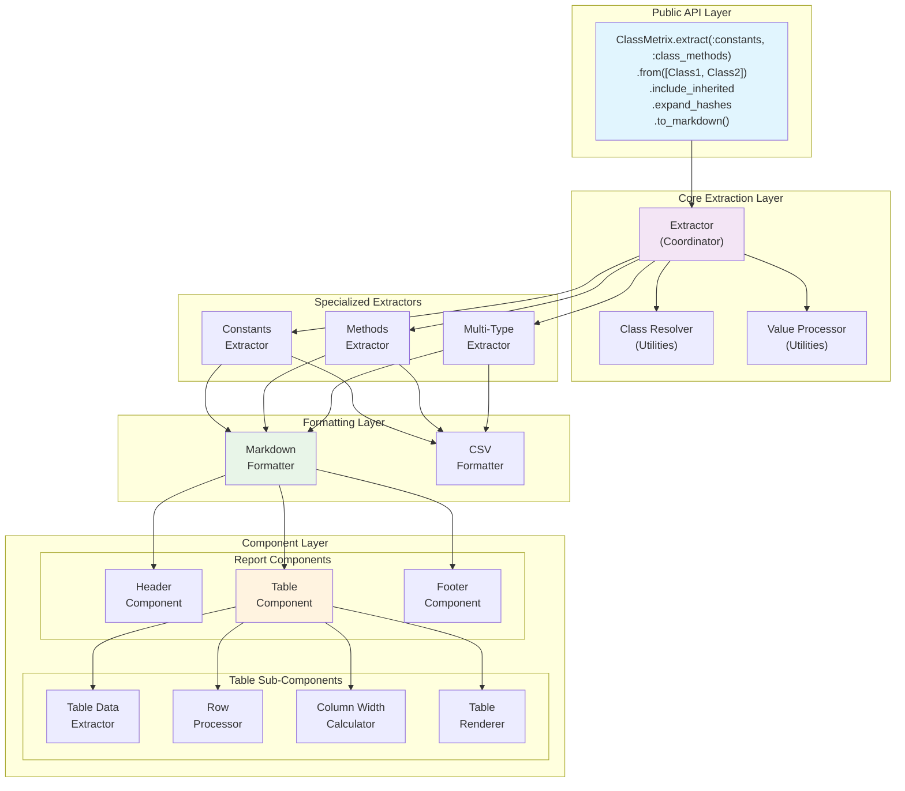
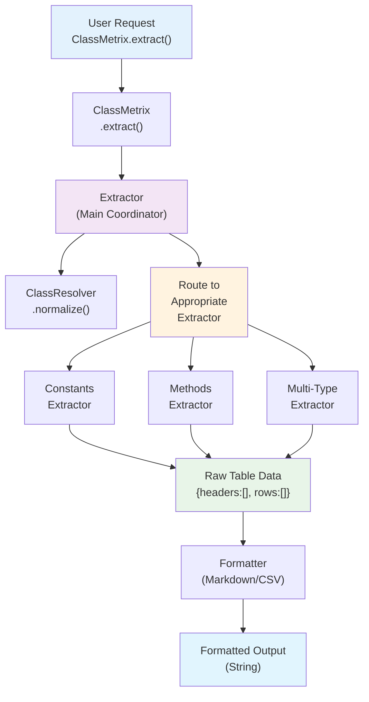
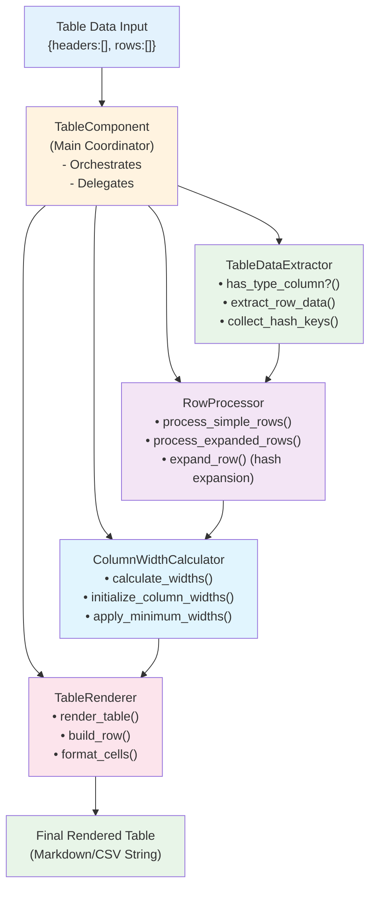
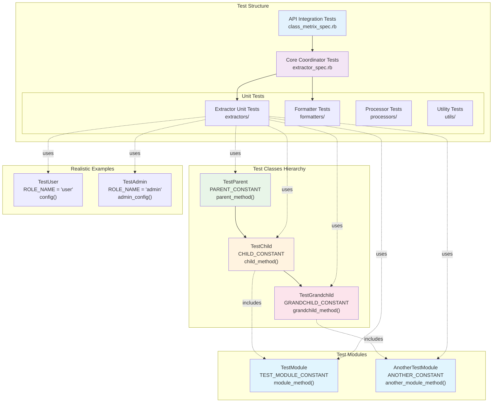

# ClassMetrix Architecture

This document provides an overview of ClassMetrix's architecture, component relationships, and code flow. It will be updated whenever the architecture changes to help developers quickly understand the codebase.

## 🏗️ High-Level Architecture

ClassMetrix follows a **modular, layered architecture** with clear separation of concerns:



## 📁 Directory Structure

```
lib/class_metrix/
├── class_metrix.rb                    # Main entry point
├── version.rb                         # Version information
├── extractor.rb                       # Core coordinator class
├── extractors/                        # Specialized extraction logic
│   ├── constants_extractor.rb         # Constants extraction & inheritance
│   ├── methods_extractor.rb           # Methods extraction & inheritance
│   └── multi_type_extractor.rb        # Multi-type combining logic
├── formatters/                        # Output formatting
│   ├── base/
│   │   ├── base_formatter.rb          # Base formatter class
│   │   └── base_component.rb          # Base component class
│   ├── shared/                        # Shared formatting utilities
│   │   ├── table_builder.rb           # Table building base class
│   │   ├── markdown_table_builder.rb  # Markdown table implementation
│   │   ├── csv_table_builder.rb       # CSV table implementation
│   │   └── value_processor.rb         # Value processing utilities
│   ├── components/                    # Modular components
│   │   ├── table_component/           # Refactored table components
│   │   │   ├── table_data_extractor.rb    # Data extraction logic
│   │   │   ├── row_processor.rb            # Row processing & hash expansion
│   │   │   ├── column_width_calculator.rb  # Column width calculation
│   │   │   └── table_renderer.rb           # Table rendering & formatting
│   │   ├── table_component.rb         # Main table component coordinator
│   │   ├── header_component.rb        # Report headers
│   │   ├── generic_header_component.rb # Multi-format headers
│   │   ├── missing_behaviors_component.rb # Missing behavior analysis
│   │   └── footer_component.rb        # Report footers
│   ├── markdown_formatter.rb          # Markdown output formatter
│   └── csv_formatter.rb               # CSV output formatter
├── processors/                        # Value processing utilities
│   └── value_processor.rb             # Handle all Ruby value types
└── utils/                            # General utilities
    └── class_resolver.rb              # Class name resolution
```

## 🔄 Data Flow

### 1. **API Entry Point**
```ruby
ClassMetrix.extract(:constants, :class_methods)
           .from([DatabaseService, CacheService])
           .include_inherited
           .expand_hashes
           .to_markdown()
```

### 2. **Request Processing Flow**



### 3. **Table Component Data Flow** (After Refactoring)



## 🧩 Core Components

### **1. Extractor (Coordinator)**
- **Purpose**: Main API interface and request coordination
- **Responsibilities**:
  - Parse user configuration
  - Route to appropriate extractors
  - Apply global filters and options
  - Coordinate inheritance/module options
- **Key Methods**: `from()`, `filter()`, `include_inherited()`, `to_markdown()`

### **2. Specialized Extractors**

#### **ConstantsExtractor**
- **Purpose**: Extract constants with inheritance/module support
- **Key Features**:
  - Own constants: `Class.constants(false)`
  - Inherited constants: Walk superclass chain
  - Module constants: Scan `included_modules`
  - Source tracking for debugging

#### **MethodsExtractor** 
- **Purpose**: Extract class methods with inheritance/module support
- **Key Features**:
  - Own methods: `Class.singleton_methods(false)`
  - Inherited methods: Walk superclass chain
  - Module methods: Scan `singleton_class.included_modules`
  - Method resolution order handling

#### **MultiTypeExtractor**
- **Purpose**: Combine multiple extraction types into unified table
- **Key Features**:
  - Add "Type" column to distinguish behavior types
  - Merge different extractor results
  - Maintain consistent table structure

### **3. Table Component Architecture** (Refactored)

The table component was recently refactored from a monolithic 269-line class into focused, reusable components:

#### **TableComponent** (Main Coordinator - 42 lines)
- **Purpose**: Orchestrate table generation process
- **Responsibilities**: Initialize sub-components, coordinate data flow
- **Pattern**: Composition over inheritance

#### **TableDataExtractor** (55 lines)
- **Purpose**: Data structure analysis and extraction utilities
- **Key Methods**: `has_type_column?()`, `extract_row_data()`, `collect_hash_keys()`
- **Responsibility**: Understand table structure and extract metadata

#### **RowProcessor** (125 lines)
- **Purpose**: Process table rows and handle hash expansion
- **Key Methods**: `process_simple_rows()`, `process_expanded_rows()`, `expand_row()`
- **Responsibility**: Transform raw data into renderable format

#### **ColumnWidthCalculator** (57 lines)
- **Purpose**: Calculate optimal column widths for table rendering
- **Key Methods**: `calculate_widths()`, `apply_minimum_widths()`
- **Responsibility**: Ensure proper table formatting

#### **TableRenderer** (56 lines)
- **Purpose**: Render final table with proper formatting
- **Key Methods**: `render_table()`, `build_row()`, `format_cells()`
- **Responsibility**: Generate final markdown table output

### **4. Formatters**

#### **MarkdownFormatter**
- **Purpose**: Generate rich markdown reports
- **Key Features**:
  - Modular component architecture
  - Professional report structure
  - Hash expansion support
  - Missing behavior analysis

#### **CsvFormatter**
- **Purpose**: Generate CSV output for data analysis
- **Key Features**:
  - Clean CSV structure
  - Configurable separators and quotes
  - Hash flattening options

### **5. Support Components**

#### **ValueProcessor**
- **Purpose**: Process all Ruby value types consistently
- **Handles**: Strings, numbers, booleans, arrays, hashes, nil, errors
- **Visual Indicators**: ✅ (true), ❌ (false/nil), 🚫 (errors), ⚠️ (warnings)

#### **ClassResolver**
- **Purpose**: Normalize class inputs (strings vs class objects)
- **Handles**: Class objects, string class names, error cases

## 🔧 Key Design Patterns

### **1. Fluent Interface**
```ruby
ClassMetrix.extract(:constants)
           .from([Class1, Class2])
           .include_inherited
           .filter(/config/)
           .expand_hashes
           .to_markdown()
```

### **2. Strategy Pattern**
- Different extractors for different extraction types
- Different formatters for different output formats
- Pluggable components for different behaviors

### **3. Composition Pattern**
- Table component composed of focused sub-components
- Formatters composed of reusable components
- Modular architecture throughout

### **4. Template Method Pattern**
- Base classes define structure
- Subclasses implement specific behaviors
- Consistent interfaces across components

## 🚀 Extension Points

### **Adding New Extraction Types**
1. Create new extractor in `extractors/`
2. Implement standard interface (`extract` method)
3. Add type routing in `MultiTypeExtractor`
4. Add API method in `Extractor`

### **Adding New Output Formats**
1. Create new formatter in `formatters/`
2. Extend base formatter class
3. Implement format-specific logic
4. Add API method in `Extractor`

### **Adding New Components**
1. Create component in `formatters/components/`
2. Extend `BaseComponent`
3. Implement `generate` method
4. Integrate into formatters

## 🧪 Testing Architecture

### **Test Structure**



### **Test Coverage**
- ✅ **Basic Extraction**: Constants and methods from simple classes
- ✅ **Inheritance**: Multi-level inheritance chains
- ✅ **Modules**: Module inclusion and method resolution
- ✅ **Error Handling**: Missing methods, constants, class resolution failures
- ✅ **Value Types**: All Ruby value types and edge cases
- ✅ **Integration**: End-to-end functionality with real-world scenarios

## 📈 Performance Considerations

### **Lazy Evaluation**
- Extractors only process data when `to_markdown()`/`to_csv()` is called
- Filters applied efficiently during extraction
- Minimal memory usage for large class sets

### **Inheritance Optimization**
- Superclass chain traversal is optimized
- Core Ruby classes (`Object`, `BasicObject`) are skipped
- Module resolution uses efficient set operations

### **Table Rendering Optimization**
- Column width calculation is performed once
- Row processing is streamlined
- String operations are minimized

## 🔄 Future Architecture Plans

### **Plugin System**
- Plugin architecture for custom extractors
- Extension points for custom components
- Configuration system for plugin management

### **Caching Layer**
- Cache class metadata for performance
- Invalidation strategies for development
- Configurable caching backends

### **Parallel Processing**
- Parallel extraction for large class sets
- Worker pool for I/O operations
- Memory-efficient streaming for large datasets

---

*This architecture document is maintained alongside code changes.* 